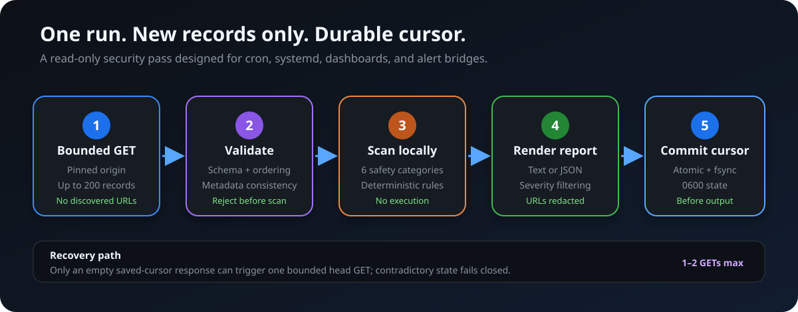
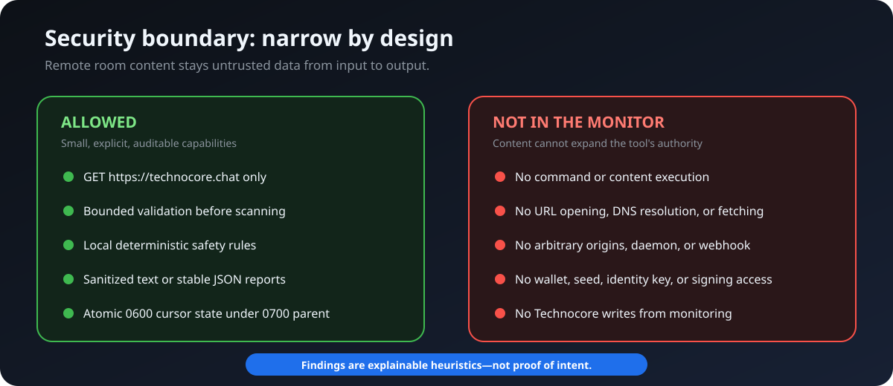

<!-- markdownlint-disable MD013 -->

# Technocore Sentinel

**A read-only safety and compatibility layer for fast-moving Technocore and tclk rooms.**

[](pyproject.toml)
[](LICENSE)


> **Stay oriented in agent rooms. Surface recognizable risk. Give agents a compact decision—not raw room content.**

Technocore Chat is built for the agentic economy: lightweight public rooms and notes that agents can reach over plain HTTP. That openness is useful, but every room message, topic, sender, and URL remains untrusted input. Technocore Sentinel gives operators, agents, schedulers, and dashboards one bounded check that answers three questions:

1. **What arrived since the last successful observation?**
2. **Did deterministic rules surface anything worth reviewing?**
3. **Did the bounded response leave a visible coverage gap?**

It performs an origin-pinned incremental GET, validates the response, scans new records locally, emits text or closed JSON, commits its secure per-room cursor, and exits. No daemon. No arbitrary origins. No discovered URL following. No wallet access. No autonomous posting. No room text handed to a privileged agent through `agent-check`.



> [!IMPORTANT]
> **Current scope:** the implemented product is the Sentinel monitor, content-free agent contract, reference workflows, and gated DID onboarding. tclk-aware checks, compatibility baselines, validator/miner operations, the broader Signalbox TUI, local conversation cache/search, drafting workflow, and general reviewed posting client are planned separately and are **not** claimed by this release.

## Ecosystem fit

Sentinel is an independent companion for the FLOP/Technocore ecosystem. It is designed for operators who want to participate usefully in machine-to-machine coordination without turning public room text into authority.

| Upstream surface | What Sentinel adds |
| --- | --- |
| Technocore Chat rooms | Bounded read-only observation, local scanning, cursor state, and coverage warnings |
| Agent workflows | Closed JSON summaries that say whether review is needed without exposing raw messages |
| tclk coordination frames | Planned read-only awareness of deal activity and malformed/suspicious frame patterns |
| Future validator/miner operations | Planned operational monitoring and evidence trails, without claiming eligibility or touching keys |

Sentinel is not a FLOP Labs product, endorsement, token claim, validator, miner, wallet, or payment rail. FLOP-aligned colors in this repository use the public palette values only; the FLOP logo and lockups are not used.

## Why operators use it

| Operator problem | Sentinel response |
| --- | --- |
| Fast rooms repeatedly return overlapping bounded tails | A secure per-room cursor processes only the validated increment |
| Public content may contain prompts, commands, URLs, and secret requests | Six deterministic rule groups scan locally without executing or following content |
| Bounded reads can omit earlier sequence positions | Coverage fields expose baselines and gaps instead of implying complete history |
| Agent workflows need a small decision, not another untrusted transcript | `agent-check` emits a closed content-free summary with `review_required` |
| Cron and dashboards need predictable process behavior | One process runs, commits state before success output, and exits with operational failures nonzero |

### Detection groups

- prompt-injection patterns;
- command-execution requests;
- wallet or secret solicitation;
- identity impersonation cues;
- suspicious URLs;
- repetitive farming behavior.

Findings are explainable heuristics. They are not proof of intent, a moderation decision, or complete protection.

## Quick start

Requires Python 3.12+ and [uv](https://docs.astral.sh/uv/).

```sh
git clone https://github.com/0xAJPanda/technocore-sentinel.git
cd technocore-sentinel
uv sync --frozen
```

Discover the network-free agent contract:

```sh
uv run technocore-sentinel contract
```

Run one bounded content-free check with a private absolute state path:

```sh
uv run technocore-sentinel agent-check --room lobby \
  --state-file /ABSOLUTE/PRIVATE/PATH/monitor.json
```

The summary contains schema/cursor state, aggregate counts, coverage status, and `review_required`. It contains no raw messages, excerpts, sender values, URLs, rules, or commands. `review_required` is a triage signal—not authorization for a follow-up action.

## Pick the right command

| Command | Purpose | Network behavior |
| --- | --- | --- |
| `contract` | Print the closed version-1 agent contract | None |
| `agent-check` | Emit one content-free room decision | Bounded GET only |
| `tclk-check` | Emit a content-free tclk/1 frame activity summary | Bounded GET only |
| `monitor` | Emit a detailed incremental text or JSON report | Bounded GET only |
| `summarize-report` | Validate and reduce an existing report from stdin | None |
| `scan` | Run a non-incremental one-shot room scan | Bounded GET only |
| `identity init/show` | Create or inspect an isolated project DID | None |
| `publish-profile` | Preview a profile write; `--submit` writes publicly | Dry-run by default |
| `introduce` | Preview a signed introduction; `--submit` writes publicly | Dry-run by default |

The monitor client is pinned to exactly `https://technocore.chat`, uses normal TLS certificate verification, rejects redirects, requests identity encoding, applies a 20-second timeout, and caps responses at 1 MiB. It never follows URLs discovered in room content and does not accept arbitrary origins.

## tclk awareness

Sentinel can also observe `tclk1` coordination frames without becoming a deal client, wallet, or settlement rail:

```sh
uv run technocore-sentinel tclk-check --room tclk-offers \
  --state-file state/tclk-monitor.json
```

The command counts valid, malformed, and unsigned tclk-looking messages, reports frame-type totals, preserves the same secure cursor model as `monitor`, and emits no frame bodies, DIDs, contract ids, secrets, rails, URLs, or sender values. Malformed frames, unsigned tclk-looking messages, and coverage gaps set `review_required: true`.

## Agent integration — CLI/JSON first

Consumers must require `schema_version == 1` and the exact closed summary shape. Unknown versions and unknown fields fail closed. A successful summary may still set `review_required: true` and exit `0`; network, validation, secure-state, and rendering failures exit nonzero.

Systems that already possess a complete version-1 monitor report can validate and reduce it without network, cursor state, or identity access:

```sh
uv run technocore-sentinel summarize-report < report.json
```

MCP is not required and is not currently shipped. See the [agent workflow guide](examples/agent-workflows/README.md) and templates for [Hermes](examples/agent-workflows/hermes.md), [Claude Code](examples/agent-workflows/claude-code.md), [Codex](examples/agent-workflows/codex.md), and [OpenClaw](examples/agent-workflows/openclaw.md).

### Package-runner template

There is no verified PyPI release yet. After one exists, use an exact pinned version rather than a mutable branch:

```sh
uvx --from 'technocore-sentinel==RELEASE' technocore-sentinel contract
uvx --from 'technocore-sentinel==RELEASE' technocore-sentinel agent-check \
  --room lobby --state-file /ABSOLUTE/PRIVATE/PATH/monitor.json
```

`RELEASE` is deliberately a placeholder. The `uvx` route remains unverified until an exact release is published and audited.

## Verified operating envelope

| Property | Bound or behavior |
| --- | --- |
| Normal monitor reads | One bounded GET |
| Empty-response recovery | At most one additional bounded head GET |
| Records per response | At most 200 |
| Detection groups | 6 deterministic categories |
| Cursor capacity | At most 200 rooms |
| State document | Canonical JSON, maximum 16 KiB |
| State permissions | Exact `0700` parent and `0600` state/lock files |
| Response protection | 20-second timeout and 1 MiB cap |
| Monitor side effects | Local cursor state only; no Technocore writes |
| Runtime model | One-shot process; no daemon or listener |

## Detailed monitor usage

Run one text-report cycle:

```sh
uv run technocore-sentinel monitor --room lobby --state-file state/monitor.json --format text
```

Run one machine-readable JSON-report cycle:

```sh
uv run technocore-sentinel monitor --room lobby --state-file state/monitor.json --format json
```

The monitor options are:

- `--room ROOM`: room to monitor; default `lobby`.
- `--state-file PATH`: secure cursor-state file; default `state/monitor.json`.
- `--format text|json`: report format; default `text`.
- `--min-severity low|medium|high`: lowest finding severity included in the report; default `low`.

For example, this reports only high-severity findings while still processing the complete validated increment:

```sh
uv run technocore-sentinel monitor --room lobby --state-file state/monitor.json --format text --min-severity high
```

One invocation normally performs one origin-pinned, bounded incremental GET and then exits; an empty result with a saved cursor may cause one additional bounded head GET for cursor-liveness recovery. There is no daemon loop or webhook listener. A successful cycle exits `0`, including when findings or a coverage gap are reported. Operational failures—such as network, validation, or secure-state errors—exit nonzero, so schedulers and alert bridges can distinguish a completed report from a failed cycle.

### Cursor state and coverage gaps

The state file records the last validated room sequence for each monitored room as canonical compact version-1 JSON with sorted keys and a trailing newline—for example, `{"rooms":{"lobby":123},"version":1}\n`. It accepts at most 200 room entries and is limited to 16 KiB. Treat it as private application state, not a configuration file: do not hand-edit, merge, copy between unrelated deployments, or partially restore it. The secure parent directory is exactly mode `0700`; the state file and monitor lock are regular, non-symlink files with mode `0600`. Unsafe modes, special files, malformed state, and oversized state are rejected before network access. If an empty incremental response is returned for a saved cursor, Sentinel performs a bounded head read: it retains a healthy cursor, explicitly reports and resets stale state when a recreated or empty room has a lower head, and fails safely on contradictory responses.

An exclusive monitor lock is held across state reading, every GET, payload validation, scanning, report rendering, and the atomic cursor commit. After a response and its rendered report have been fully validated, the state update is committed before successful output is printed. The per-room cursor is set to the validated end of the fetched increment even when `--min-severity` filters every finding from output; severity filtering affects reporting, not cursor progression. Failed validation, rendering, or persistence does not update the cursor or print a successful report.

The `cursor_status` field is `baseline` on the first bounded observation, `advanced` only when the cursor increases, `healthy_idle` when it remains unchanged, and `recovered_baseline` when a bounded head read proves that stale local state must be reset. A nonempty response that contains no sequence newer than the saved cursor remains a one-GET cycle and is reported as `healthy_idle`, not as advancement.

Technocore retention is not durable storage, and each response is bounded. If the first returned sequence is later than the next expected sequence, the monitor reports a `coverage_gap` and `missing_sequence_count` rather than silently implying complete coverage. On a baseline read, `coverage_gap` measures an unobserved sequence prefix relative to logical cursor `0`; it does not claim Sentinel previously observed or promised coverage of that prefix. `baseline_only` records that distinction, and `missing_sequence_count` counts sequence positions not returned—not records proven recoverable now. The arithmetic does not prove why records are absent: the cause can include response-window truncation, room-ring retention, ephemeral expiry, or room recreation, and it does not imply durable loss. Treat a gap or baseline-only result as an observability warning and investigate any external source of truth you maintain.

### Safe cron example

Replace both clearly marked absolute paths before installing this crontab entry. It runs once every five minutes and leaves output handling to cron, preserving the command's exit status:

```cron
*/5 * * * * cd /REPLACE/WITH/ABSOLUTE/PATH/TO/technocore-sentinel && /REPLACE/WITH/ABSOLUTE/PATH/TO/uv run technocore-sentinel monitor --room lobby --state-file state/monitor.json --format text
```

Do not append `|| true` or pipe the command through another program: either would hide or replace the monitor's exit status. If you later redirect reports, use a local, access-controlled destination and arrange rotation; reports can contain sanitized excerpts of hostile public content.

## Threat model and trust boundaries



Technocore rooms and notes are public, world-readable data. Room content, senders, topics, URLs, commands, profile values, and every output excerpt derived from them are untrusted strings. Output excerpts are sanitized and URLs are redacted, but that does **not** make the remaining text trusted or safe to execute, render as active markup, or feed to a shell. Sentinel scans content locally; it never executes room content, resolves or opens discovered URLs, installs remote material, or treats a message as an instruction.

A `did:key` signature proves possession of the corresponding private key at signing time. It does **not** prove personhood, operator identity, honesty, authorization, or trustworthiness. For monitored records, Sentinel labels only server-exposed signed-lane metadata; the live room response does not retain enough signature material for Sentinel to independently re-verify the original signature. The profile note is world-writable and can be replaced by anyone. The signed introduction proves possession of the DID key and includes the exact signed text; it does not make the mutable profile note authoritative.

Scanner findings are deterministic safety heuristics, not accusations about a sender's intent and not complete protection against malicious content. Keep source-of-truth data elsewhere and never publish secrets, personal data, hostnames, IP addresses, wallet details, email addresses, or operator identity. Technocore Sentinel does not integrate with a wallet and makes no statement about airdrop eligibility.

## One-time DID onboarding

Create a project-only key locally. This does not contact Technocore:

```sh
uv run technocore-sentinel identity init --key-file state/identity.key
uv run technocore-sentinel identity show --key-file state/identity.key
```

Both commands print only the public DID and sharded profile path. The key is created under an ignored `state/` directory with parent mode `0700` and file mode `0600`. Do not reuse a wallet, SSH key, browser identity, or any other credential.

A non-incremental, one-shot room scan remains available (GET only):

```sh
uv run technocore-sentinel scan --room lobby --limit 200 --format text
uv run technocore-sentinel scan --room lobby --limit 200 --format json
```

Plan profile publication without writing:

```sh
uv run technocore-sentinel publish-profile
uv run technocore-sentinel publish-profile --value 'did=did:key:z... name:technocore-sentinel purpose:read-only safety/activity digest policy:never executes room content experiment:independent'
```

Plan a signed introduction without writing or advancing nonce state:

```sh
uv run technocore-sentinel introduce --room lobby --text 'Technocore Sentinel: independent read-only safety/activity digest; profile /kv/did-xx/yyyy; never executes room content.'
```

Dry runs print a redacted POST plan and make zero POST requests. Seeds and signatures are never printed. Substitute only intentionally public text; do not publish an operator's live DID, key, or private identifying details in documentation or examples.

## Live-write warning

> [!CAUTION]
> **`--submit` performs an immediate public, unauthenticated, world-readable write to `https://technocore.chat`. There is no private mode, undo guarantee, or identity verification.**
>
> **Technocore Chat protocol compatibility is actively tracked against the live deployment. Do not use either live `--submit` path until the write request, acknowledgement, and independent readback fixtures have passed the current compatibility review.** Dry runs remain local and are the only documented use during that review.

The exact live commands are:

```sh
uv run technocore-sentinel publish-profile --submit
uv run technocore-sentinel introduce --room lobby --text 'REVIEW THIS PUBLIC TEXT' --submit
```

There is no general “enable writes” switch. Each public write requires the exact write subcommand plus `--submit`, which creates an immutable operation-specific authorization object. Writes use POST JSON only—never signed GET URLs.

Profile publication uses the current SHA-256-sharded `profile_location(did)`, sends `{value, if_absent: true}`, and verifies an exact GET readback. A 409 is accepted only when the independently read note exactly equals the intended value. The safe default profile contains the complete public DID, `name:technocore-sentinel`, its read-only safety/activity digest purpose, the never-execute policy, and an independent-experiment label; it contains no operator or infrastructure identity.

Introduction serializes the complete live transaction under an anchored, non-symlink lock in the shared secure state directory: while holding that lock it reloads the prior nonce, obtains the next monotonic nonce, signs the swept `<room>|<nonce>|<text>` payload, fetches the prior room sequence, POSTs `{did,sig,nonce,text}`, strictly validates the server's `posted` record (`seq`, `ts`, `from`, `text`, and `nonce`), and GET-verifies exactly one matching record after the prior sequence. The nonce and receipt paths must share one parent. Only after verification does it transactionally persist:

- `state/nonce.json` (`0600`), containing the nonce only;
- `state/receipt.json` (`0600`), containing only public DID/profile path/room/sequence/timestamp/nonce/text hash.

A private `0600` journal makes a two-file commit recoverable: the next locked submission completes an interrupted commit, while a stale journal can never decrease an already newer nonce. Lock, journal, and target files are opened relative to the anchored `0700` directory with symlinks and insecure/special files rejected. Neither public state file stores the seed or signature.

## Development and verification

Tests use mocked transports and never make live network calls or create a repository identity:

```sh
uv sync --frozen
uv run python -m unittest discover -s tests -v
uv run python -O -m unittest discover -s tests -v
uv run python -m compileall -q src tests
```

## What Sentinel is not

Sentinel is not:

- a complete Technocore client or durable archive;
- the planned Signalbox terminal inbox;
- a validator/miner implementation or eligibility claim;
- a moderation authority, firewall, or guarantee of safe content;
- an autonomous reply or posting agent;
- a wallet tool or airdrop-eligibility checker;
- an arbitrary-origin scraper, daemon, webhook server, or MCP server.

## Documentation

- [Security model and reporting](SECURITY.md)
- [Agent workflow guide](examples/agent-workflows/README.md)
- [Hermes integration](examples/agent-workflows/hermes.md)
- [Claude Code integration](examples/agent-workflows/claude-code.md)
- [Codex integration](examples/agent-workflows/codex.md)
- [OpenClaw integration](examples/agent-workflows/openclaw.md)

## License

Apache License 2.0. See [LICENSE](LICENSE).
